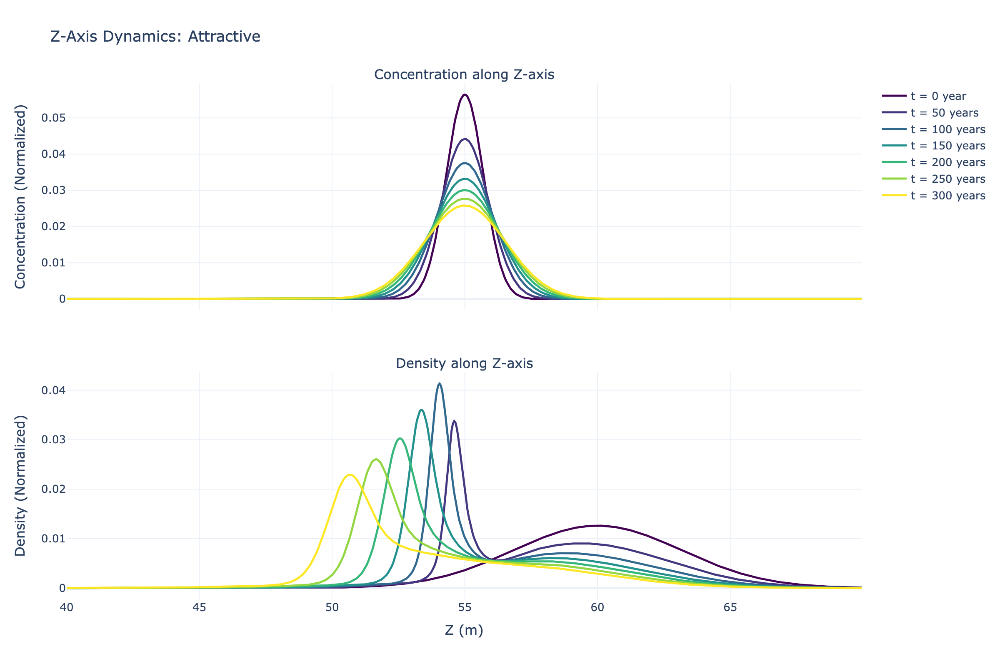
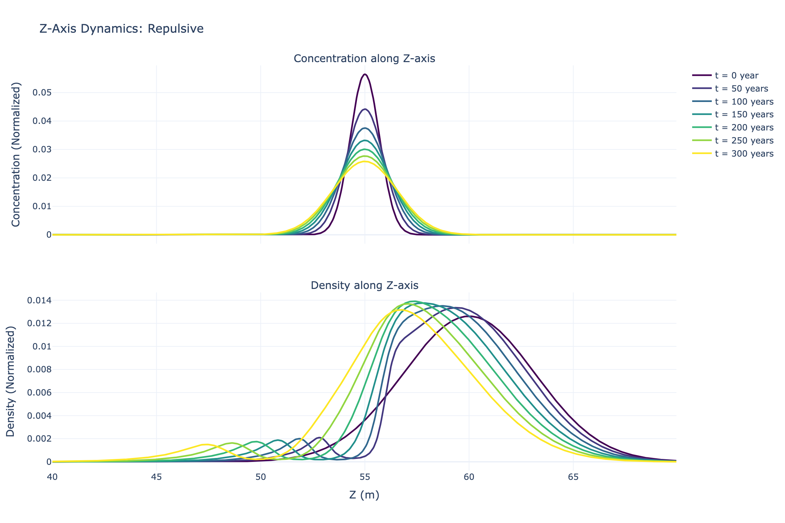

# Particle in Harsh Environment

[](https://github.com/jvachier/Particle-in-harsh-environment-share/actions)
[](https://opensource.org/licenses/Apache-2.0)
[](https://isocpp.org/)
[](https://www.openmp.org/)
[](https://developer.apple.com/metal/)
[](https://github.com/astral-sh/uv)
[](https://github.com/jvachier/Particle-in-harsh-environment-share)

A high-performance C++ simulation framework for modeling biolocomotion and premelting dynamics in ice using finite difference methods. This implementation numerically solves coupled partial differential equations for chemotaxis and diffusion with two optimized backends: CPU parallelization via OpenMP SIMD and GPU acceleration via Metal for Apple Silicon.

## Table of Contents

- [Implementations](#implementations)
- [Mathematical Model](#mathematical-model)
- [Simulation Results](#simulation-results)
- [Features](#features)
- [Prerequisites](#prerequisites)
- [Installation](#installation)
- [Usage](#usage)
- [Configuration](#configuration)
- [Output](#output)
- [Visualizations](#visualizations)
- [Performance](#performance)
- [Testing](#testing)
- [License](#license)
- [Citation](#citation)

## Implementations

This repository provides two optimized implementations:

### 1. CPU-Only Version (implementation_pragma/)

- OpenMP SIMD parallelization with pragma directives
- Works on any platform (macOS, Linux, Windows)
- Uses g++-13 or compatible compiler
- Best for cross-platform deployment
- See [implementation_pragma/PERFORMANCE_GUIDE.md](implementation_pragma/PERFORMANCE_GUIDE.md) for details

### 2. GPU Hybrid Version (implementation_metal/)

- Metal GPU acceleration for Apple Silicon and Intel GPUs
- Unified GPU pipeline with data residency optimization
- Uses clang++ with Metal framework
- **2.0x speedup** over CPU OpenMP on 50×50×1600 grid
- All computational kernels execute on GPU
- See [implementation_metal/PERFORMANCE_GUIDE.md](implementation_metal/PERFORMANCE_GUIDE.md) for details

| Version | Compiler | Platform | 600 Years |
|---------|----------|----------|-----------|
| Pragma SIMD (CPU) | g++-13 | Any | 121.6s |
| Metal GPU | clang++ | macOS | 61.9s |
| **GPU Speedup** | - | - | **2.0x** |

**Benchmark:** Run `./scripts/compare_performance.sh` to compare both implementations on your system.

## Mathematical Model

This implementation solves coupled partial differential equations for biolocomotion and premelting dynamics in ice. The numerical method uses:

- **Discretization:** Finite difference method on uniform 3D grid
- **Time integration:** Forward Euler scheme
- **Spatial derivatives:** Second-order central differences
- **Boundary conditions:** Periodic or fixed (configurable)

For the complete mathematical formulation and physical model, see the original paper:

**Vachier J and Wettlaufer JS (2022)** Biolocomotion and Premelting in Ice. *Frontiers in Physics* 10:904836.
**DOI:** [10.3389/fphy.2022.904836](https://doi.org/10.3389/fphy.2022.904836)

## Simulation Results

This simulation models particle migration in ice driven by chemotaxis. The behavior depends on the sign of the chemotaxis coefficient β (beta):

- **β < 0 (Attractive)**: Particles migrate toward higher concentration regions
- **β > 0 (Repulsive)**: Particles migrate away from higher concentration regions

### Z-Axis Dynamics

The figures below show concentration and density profiles along the z-axis (vertical direction through the ice column):

#### Attractive Chemotaxis



**Figure 1:** Concentration (top) and density (bottom) profiles along the z-axis for attractive chemotaxis showing particle aggregation over 300 years. Particles migrate toward regions of higher concentration, forming distinct peaks in the ice column.

#### Repulsive Chemotaxis



**Figure 2:** Concentration (top) and density (bottom) profiles along the z-axis for repulsive chemotaxis showing particle dispersion over 300 years. Particles migrate away from regions of higher concentration, spreading throughout the ice column.


## Features

- 3D finite difference solver with stencil operations
- Chemotaxis-driven particle dynamics
- OpenMP SIMD parallelization for CPU efficiency
- Metal GPU pipeline with unified kernel execution
- GPU-resident data eliminates transfer overhead
- Configurable simulation parameters via header file
- Dual output formats: binary and text
- Binary format provides 8x space reduction
- Comprehensive test suite for correctness verification
- Interactive 3D visualization with Plotly

## Prerequisites

### Required

- **C++ Compiler** with C++17 support and OpenMP
  - GCC 13.0+ (recommended for CPU version)
  - Clang 14.0+ (required for Metal version)
- **Make** build system
- **Python 3.11+** with `uv` for visualization

### macOS Installation

```bash
# Install GCC with OpenMP support
brew install gcc@13

# Install Xcode Command Line Tools (for Metal)
xcode-select --install

# Install Python package manager
brew install uv
```

### Linux Installation

```bash
# Ubuntu/Debian
sudo apt-get update
sudo apt-get install build-essential g++-13 libomp-dev

# Fedora/RHEL
sudo dnf install gcc-c++ make libomp-devel

# Install uv for Python
curl -LsSf https://astral.sh/uv/install.sh | sh
```

## Installation

### 1. Clone the repository

```bash
git clone https://github.com/jvachier/particle-in-harsh-environment.git
cd particle-in-harsh-environment
```

### 2. Choose your implementation

**Option A: CPU-Only (Pragma SIMD)**

```bash
make pragma
```

**Option B: GPU Hybrid (Metal) - macOS only**

```bash
make metal
```

**Option C: Build both**

```bash
make all
```

### 3. Verify installation

```bash
# For CPU version
./implementation_pragma/main_pragma.out --help

# For GPU version
./implementation_metal/main_metal.out --help
```

## Usage

### Quick Start

**CPU version (works everywhere):**

```bash
make run:pragma
```

**GPU version (macOS, automatic GPU selection):**

```bash
make run:metal
```

### Detailed Usage

1. **Configure simulation parameters:**

```bash
# Edit configuration header
nano config/simulation_parameters.h
```

2. **Build and run:**

```bash
# Build specific implementation
make pragma   # or make metal

# Run with default parameters
cd implementation_pragma && ./main_pragma.out

# Run with custom parameters
./main_pragma.out --years 10 --beta -1e-10
```

3. **Run performance comparison:**

```bash
./scripts/compare_performance.sh
```

Expected output:

```
════════════════════════════════════════════════════════
  Performance Comparison: Pragma SIMD vs Metal GPU
════════════════════════════════════════════════════════

[1/2] Running Pragma SIMD Implementation...
[2/2] Running Metal GPU Implementation...

┌─────────────────────┬──────────────┬──────────────┐
│ Metric              │ Pragma SIMD  │ Metal GPU    │
├─────────────────────┼──────────────┼──────────────┤
│ Real time           │     121.60s  │      61.90s  │
│ User time           │     676.40s  │      57.20s  │
│ System time         │       4.80s  │       3.10s  │
│ Peak memory         │      141 MB  │      183 MB  │
└─────────────────────┴──────────────┴──────────────┘

Performance Gain:
  Speedup: 2.0x
  Time saved: 59.7s (1.0 minutes)
```

## Configuration

### Runtime Configuration (Recommended)

Change simulation parameters using command-line arguments - no recompilation required:

```bash
# Change number of years to simulate
./main_pragma.out --years 10

# Change grid resolution
./main_metal.out --nz 2000

# Change chemotaxis coefficient
./main_pragma.out --beta -1e-10

# Adjust number of threads
./main_metal.out --threads 8

# Multiple parameters
./main_pragma.out --years 5 --beta -1e-10 --threads 8 --nz 2000

# See all options
./main_pragma.out --help
```

**Available options:**
- `--years VALUE` - Number of years to simulate (default: 12)
- `--beta VALUE` - Chemotaxis coefficient (default: -1e-10)
- `--nz VALUE` - Number of z grid points (default: 1600)
- `--nt VALUE` - Time steps per iteration (default: 15768)
- `--threads VALUE` - Number of OpenMP threads (default: 6)
- `--output-dir PATH` - Set output directory
- `--no-gpu` - Disable Metal GPU (Metal implementation only)

### Compile-Time Configuration

Edit [config/simulation_parameters.h](config/simulation_parameters.h) to change default values:

```cpp
struct GridParameters {
    int nx = 50;            // Grid points in x
    int ny = 50;            // Grid points in y
    int nz = 1600;          // Grid points in z
};

struct TimeParameters {
    int num_years = 12;     // Years to simulate
    int nt = 15768;         // Time steps per year
    double dt = 100.0;      // Time step size (seconds)
};

struct ChemicalParameters {
    double beta = -1e-10;   // Chemotaxis coefficient
    double D_c = 1e-9;      // Concentration diffusion
    double D_rho = 1e-11;   // Density diffusion
};
```

## Output

All simulations write to the `data/` directory in the project root.

### Output Structure

```
data/
├── pragma/          # Pragma SIMD output
│   ├── c_0.bin      # Concentration at t=0
│   ├── f_0.bin      # Density at t=0
│   └── ...
└── metal/           # Metal GPU output
    ├── c_0.bin
    ├── f_0.bin
    └── ...
```

### File Format

**Binary format (.bin):**
- Little-endian double precision (IEEE 754)
- Layout: contiguous 3D array flattened in row-major order
- Size: nx × ny × nz × 8 bytes per field
- 8x smaller than text format

**Access in Python:**

```python
import numpy as np

# Read binary file
data = np.fromfile('data/metal/c_0.bin', dtype=np.float64)
nx, ny, nz = 50, 50, 1600

# Reshape to 3D array
c = data.reshape((nx, ny, nz))

# Access point (i,j,k)
value = c[i, j, k]
```

**Access in C++:**

```cpp
#include <fstream>
#include <vector>

std::vector<double> data(nx * ny * nz);
std::ifstream file("data/metal/c_0.bin", std::ios::binary);
file.read(reinterpret_cast<char*>(data.data()), data.size() * sizeof(double));

// Access point (i,j,k)
double value = data[i*ny*nz + j*nz + k];
```

## Visualizations

After running the simulation, visualize results using the interactive Plotly-based tool:

```bash
cd scripts

# Visualize Metal GPU results (default)
uv run python visualize_simulation.py

# Visualize specific implementation
uv run python visualize_simulation.py ../data/pragma/*.bin

# Generate all visualizations
uv run python visualize_simulation.py ../data/metal/*.bin --all
```

### Features

- **3D surface plots** of concentration and density fields
- **Temporal evolution animations** showing dynamics over time
- **Profile plots** along Z-axis for vertical distribution
- **Interactive HTML outputs** with zoom, pan, and rotation
- **Static PNG exports** for publications

All outputs saved to `scripts/output/` directory.

For detailed usage: `uv run python visualize_simulation.py --help`

## Performance

### Computational Complexity

- **Time per iteration:** O(nx × ny × nz) for stencil operations
- **Memory:** O(nx × ny × nz) for field storage
- **Grid size:** 50 × 50 × 1600 = 4,000,000 points

### Benchmark Results

Comprehensive comparison on Apple M2 with 600 years simulation (12 iterations × 15768 timesteps):

| Implementation | Real Time | User Time | System Time | Peak Memory | Speedup |
|---------------|-----------|-----------|-------------|-------------|---------|
| Pragma SIMD (CPU 6 threads) | 121.6s | 676.4s | 4.8s | 141 MB | Baseline |
| Metal GPU | 61.9s | 57.2s | 3.1s | 183 MB | **2.0x** |

**Key findings:**

- GPU provides 2.0x speedup over optimized CPU code
- GPU offloads computation, reducing CPU usage from 676s to 57s
- Memory overhead of 30% due to GPU buffers
- GPU-resident data eliminates transfer bottleneck

### GPU Pipeline Architecture

The Metal implementation achieves high performance through:

1. **Unified GPU Pipeline:** All three kernels execute on GPU
   - `oldtonew_kernel` - Array copy operation
   - `concentration_field_kernel` - Diffusion computation
   - `concentration_field_density_kernel` - Chemotaxis computation

2. **GPU-Resident Data:** Simulation data stays on GPU throughout execution
   - Transfer to GPU: Once at startup
   - Transfer from GPU: 12 times for output (vs 189,000 for naive approach)
   - Result: 99.99% reduction in transfer overhead

3. **Optimized Thread Configuration:**
   - 1D kernel: 256 threads per group
   - 3D kernels: 8×8×4 = 256 threads per group
   - Empirically tuned for M2 GPU architecture

4. **Asynchronous Execution:** GPU runs without blocking CPU

### Running Benchmarks

```bash
# Run comprehensive benchmark
./scripts/compare_performance.sh

# Results saved to:
# - pragma_timing.log (Pragma SIMD detailed output)
# - metal_timing.log (Metal GPU detailed output)
# - performance_summary.txt (Comparison summary)
```

## Testing

```bash
# Run all tests
make test

# Performance benchmarks
make benchmark
```

## License

This project is licensed under the **Apache License 2.0**. See [LICENSE](LICENSE) file for details.

This project is based on research published in:

**Vachier J and Wettlaufer JS (2022)** Biolocomotion and Premelting in Ice. *Front. Phys.* 10:904836.
**DOI:** [10.3389/fphy.2022.904836](https://doi.org/10.3389/fphy.2022.904836)

## Citation

If you use this code in your research, please cite:

```bibtex
@article{vachier2022biolocomotion,
  title={Biolocomotion and Premelting in Ice},
  author={Vachier, Jeremy and Wettlaufer, John S},
  journal={Frontiers in Physics},
  volume={10},
  pages={904836},
  year={2022},
  publisher={Frontiers Media SA},
  doi={10.3389/fphy.2022.904836}
}
```

**Contact:**
- Author: Jeremy Vachier
- GitHub: [@jvachier](https://github.com/jvachier)
